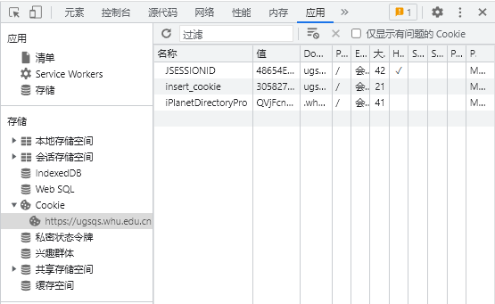
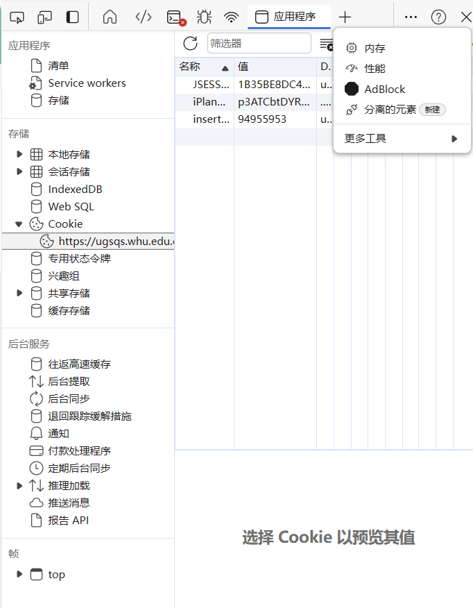
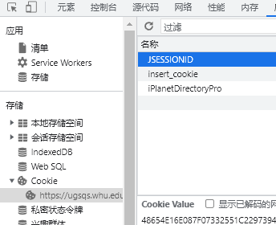
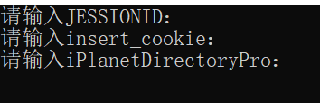

# 武汉大学自动评教

## 介绍

同学们在考试过后需要在评价系统中评教后才能查询成绩，往往大多数人都厌烦这种~~形式主义的~~行为，于是我就做了这个脚本，帮助大家快速评教

**新功能**

盛夏六月，正值我武出成绩之时，但是你是否被未评教无法查看成绩所困扰？在满心期待的打出一个接近满分的评教分数之后又被深深的伤到。之后，你想修改该课程的分数，于是你看到了这句话：

所以，为了~~打击报复~~回馈老师，我推出了评教1.1版本，绕过限制对评教内容进行修改。

## 环境

> python

## 使用方法

打开[评教系统](https://ugsqs.whu.edu.cn/new/student/)

按下`F12`打开开发者工具

Chrome：

Edge:

选中cookie的项目

将下面的`Cookie Value`填入程序里即可

### 正式版

按提示填入Cookie即可

[下载](https://github.com/MrLinda/WHUAutoEvaluate/releases/download/V1.1.0/WHUAutoEvaluate.exe)

