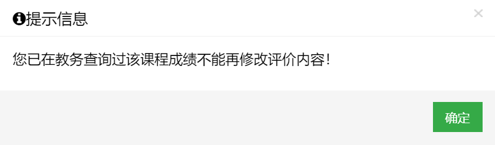

# 武汉大学自动评教

## 介绍

同学们在考试过后需要在评价系统中评教后才能查询成绩，往往大多数人都厌烦这种~~形式主义的~~行为，于是我就做了这个脚本，帮助大家快速评教

**新功能**

盛夏六月，正值我武出成绩之时，但是你是否被未评教无法查看成绩所困扰？在满心期待的打出一个接近满分的评教分数之后又被深深的伤到。之后，你想修改该课程的分数，于是你看到了这句话：

所以，为了~~打击报复~~回馈老师，我推出了评教1.1版本，绕过限制对评教内容进行修改。

## 环境

> python
> 
> requests
> 
> selenium

## 使用方法

### 下载

[进入下载页面](https://github.com/MrLinda/WHUAutoEvaluate/releases)

### 船新版本

1. 打开软件
2. 点击获取按钮
3. 在弹出的Edge窗口中登录
4. 等待片刻即可获取到教务系统cookie
5. 点击查询，会将本次需要评教的课程显示出来
6. 在得分百分比处填写需要给课程评的分数、在每门课程完成时间填写一门课评价完之后等待的时间
7. 点击自动评教，等待完成
8. 如果需要修改评分，可以在左侧列表中选中课程后使用软件右下区域修改评分

