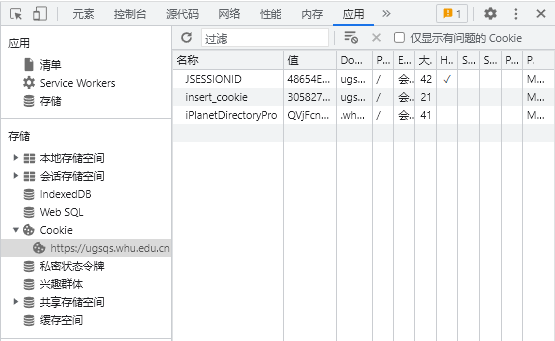
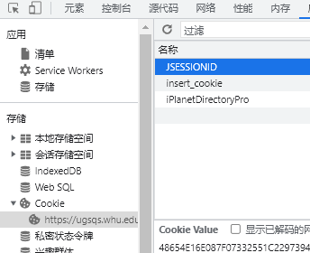
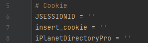

# 武汉大学自动评教

## 介绍

同学们在考试过后需要在评价系统中评教后才能查询成绩，往往大多数人都厌烦这种~~形式主义的~~行为，于是我就做了这个脚本，帮助大家快速评教

## 环境

> python

## 使用方法

打开[评教系统](https://ugsqs.whu.edu.cn/new/student/)

按下`F12`打开开发者工具

选中cookie的项目

将下面的`Cookie Value`填入程序里即可

### 正式版

依次填入Cookie即可

[下载](https://github.com/MrLinda/WHUAutoEvaluate/releases/download/V1.0.0/WHUAutoEvaluate.exe)